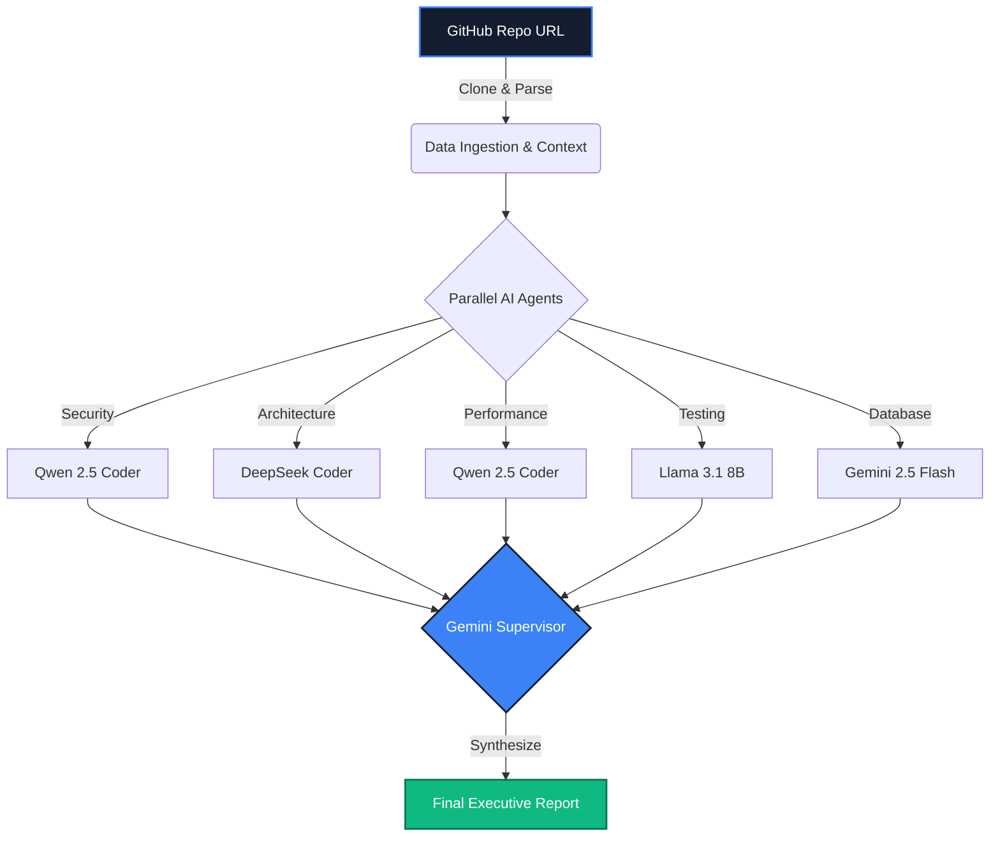

<div align="center">
  

  <h1>CodeBeast AI</h1>
  <p><strong>Multi-Agent Repository Intelligence & Automated Scoring Platform</strong></p>

  <p>
    <a href="#why-codebeast">WHY</a> •
    <a href="#architecture">ARCHITECTURE</a> •
    <a href="#quickstart">QUICKSTART</a> •
    <a href="#scoring--evaluation">EVALUATION</a>
  </p>

  <p>
    
    
    
    
  </p>
</div>

## ♦ Why CodeBeast?

Most repository evaluation tools rely on simple static analysis or a single AI prompt that quickly hallucinates. **CodeBeast** spins up **5 specialized LLM experts** in parallel, analyzes the exact structure of your repository, and synthesizes a verifiable executive summary. 

Designed specifically for **hackathons, technical hiring, and automated code reviews**, CodeBeast saves hours of manual code reading by combining strict deterministic heuristics with advanced AI code comprehension.

---

## ♦ Architecture

CodeBeast runs a robust server-side multi-agent pipeline using LangGraph, ensuring deep, context-aware analysis without overwhelming browser memory.



---

## ♦ Scoring & Evaluation

The final score (0-100) is a hybrid calculation ensuring strict fairness and deep insight.

### 1. Deterministic Engine (The Hard Cap)
Before the AI even reviews your code, our deterministic engine checks for plagiarism or low-effort submissions. If a repository has **fewer than 3 commits**, the score is hard-capped at **50**, preventing copy-paste cheating.

### 2. Multi-Agent Evaluation Weights
*   **Architecture & Code Quality:** ~30%
*   **Security Practices:** ~20%
*   **Testing & CI/CD:** ~20%
*   **Database & State Management:** ~15%
*   **Performance:** ~15%

---

## ♦ Major Engineering Highlights

*   **Zero-Buffering Live WebSockets:** Built a custom state-inference UI layer. When a WebSocket connects, it instantly fetches the `last_eval_task` from Redis and infers previous states (e.g., if Security is running, Ingestion must be done) to guarantee frame-one accurate animations.
*   **Graceful Offline Degradation:** If the cloud LLMs (Gemini) hit a `429 Rate Limit`, the LangGraph orchestrator gracefully degrades to an **Offline Mode**, falling back to local Ollama models and the Deterministic Scoring Engine so the user is never left without a report.

---

## ♦ Quickstart

### 1. Backend (FastAPI)
```bash
cd backend
python -m venv .venv
source .venv/Scripts/activate
pip install -r requirements.txt

# Start the server
uvicorn main:app --reload
```

### 2. Celery Worker (Task Queue)
```bash
cd backend

# Start the background task worker
celery -A app.worker.celery_app worker --loglevel=info -P threads
```

### 3. Frontend (Next.js)
```bash
cd frontend
npm install

# Start the dashboard UI
npm run dev
```

*Note: Ensure you have a running Redis instance on `localhost:6379` for the Celery workers and WebSockets.*
